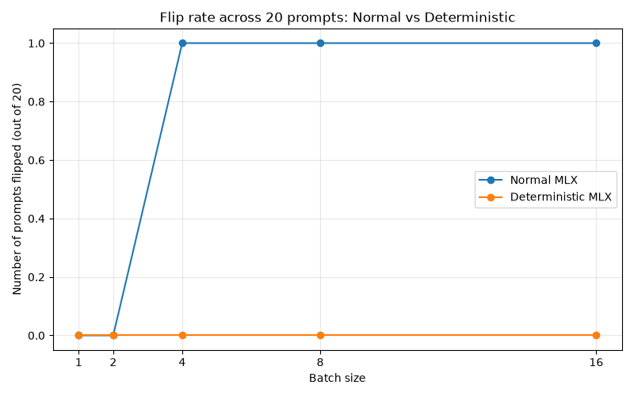

# Batch-Dependent Behaviour in Aligned Language Models

The full research idea and findings are here [Idea-MATS-2027.pdf](here)

## Research question

When an aligned language model is evaluated with the same prompt and weights, can changing only the batch size change its output? If so, can batch-invariant deterministic inference reduce this instability enough to matter for alignment evaluation?

This project studies that question using MLX inference and the 4-bit model `mlx-community/Qwen2.5-0.5B-Instruct-4bit`. The deterministic condition uses `mlx-deterministic`, following the batch-invariance approach described in [Defeating Nondeterminism in LLM Inference](https://thinkingmachines.ai/blog/defeating-nondeterminism-in-llm-inference/).

## Summary of findings

Using mlx-community/Qwen2.5-0.5B-Instruct-4bit model , and with deterministic using mlx-deterministic following the approach of “Defeating Nondeterminism in LLM Inference” [1].

Experiment 1 : Residual stream divergence from batch sizes
With single prompt and single forward-pass, for the 24 layers , comparing batch-1 and batch-16 the divergence (L2 norm) start from 0 at the embedding layer then grows roughly to ~= 0.73 by the final layer, which approximately ~170x increase from numeric perturbation.
That shows unstable computation propagating through layers.

Experiment 2 : Fixed prompt with patch sizes [1,2,4,8,16] , and 5 repeated run each , predictions flip from ‘Yes’ to ‘To’ at batch >= 4, max Δ logits ~=0.094, as shown :

Experiment 3 :  Deterministic (Batch Invariant) vs. normal mode , same prompt
Repeating experiment 2, but this time with mlx-deterministic batch invariant kernel enabled. Result shows deterministic stabilised the decision on prompt.

Even with 20 prompts, the result shows “batch invariance helps stability of the final 
decision” (not reduce numerical noise)

Limitations
Singla small quantized model and limited set of single prompts.
Compute single token decision, not complete generation or safety/alignment behavior.
Deterministic stabilisation final decision, but not consistency reduces numerical logits.
 
Next Step
Trying large set of prompts
Replicated across models, batch sizes, seeds, numerical precisions
Analyse the relationship between logit divergence, top-1/top-2 margin, decision flips.
Test safety/refusal prompts and check whether it affects the safety-relevant behaviour.
